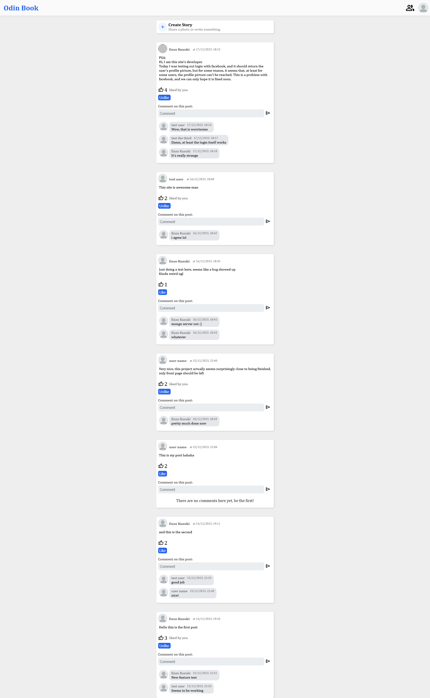

# Odin Book

Here we go, this is the final project of [The Odin Project](https://www.theodinproject.com/)'s Node course. In essence, it is a basic Facebook clone, appropriately named Odin-Book. It uses Node for the back-end, and React for the front-end, as usual.

In this app you first sign up and create your user account, or log in with your facebook account, which grants access to the rest of the site. The main page has all of the posts displayed starting with most recent, which can be liked or commented on, and you can also create your own. On the top left of the page you have a link to a user list, which lists all of the users on the site, as well as your friends or friend requests that you have received or sent. You can also check your own profile, which lists all your posts.
Furthermore, if you click at a user on the user list page or their username on a post comment, you can look at their profile page as well, which displays all of their posts and also allows you to look at their friend list.

This was a very complex project to make, and very intimidating at the start, but I am very proud on how it turned out. It is very basic, and there are still things I want to add to it later, but it works pretty well.

While developing this project, I started with the front-end, finishing all visual aspects before developing any back-end functionality. I would say I did a good job, it should also work perfectly on all screen sizes. After spending a few days working on the front-end, I moved on to the back-end, which went pretty well initially, as I have earned experience from previous projects. This was until I implemented the 'log in with facebook' function, which, while not exactly complex, did take a lot of trial and error to be implemented correctly. But in the end, it all ended up working well. I honestly thought it would take me longer to finish this project.

Now, logging in with facebook is supposed to show your facebook profile picture on the site, but it seems that this function [is not working properly](https://developers.facebook.com/community/threads/292690177015780/) as of December 2023. As such, some users may be able to see their profile picture properly, but others may not. It seems this cannot be fixed at the moment.

App link: https://odin-book01.fly.dev/

Currently I am having problems logging in with Facebook on the deployed app, even though it works just fine on my machine. As such, if you want to try it out, please just log in normally.